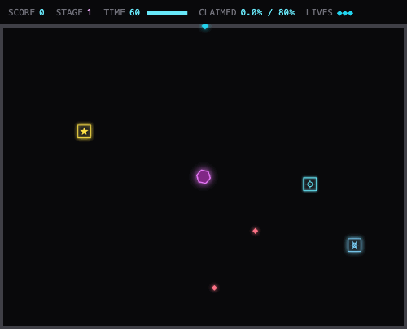

# Territory Raider

[한국어](../README.md) · **English**

A Volfied/Qix-style **territory-capture** game built with **React 18 + TypeScript (strict) + Canvas 2D** — no game-engine libraries. Cut into the dark, fence off the boss, and claim 80% of the field across an endless campaign with a **boss battle every 5th stage**.

The name, art, and audio are original; only the genre mechanics are borrowed. All visuals are shape-and-code generated on a dark zinc/slate palette with cyan/fuchsia neon accents.



*Cutting territory out of the dark while the stage clock drains — the enemies accelerate as **TIME** turns amber (20 s) and then red (10 s).*

## Quick start

```bash
npm install
npm run dev        # http://localhost:5173
npm test           # headless engine unit tests (Vitest)
npm run build      # tsc --noEmit + production build
npm run typecheck  # tsc --noEmit only
```

## Desktop app (Electron)

The same game ships as a native desktop app (macOS · Windows · Linux) via a thin,
security-hardened Electron shell. The web build is untouched — the renderer stays
a pure Vite app; only `electron/` (main + preload) and `scripts/` are added.

```bash
npm run dev:desktop   # Electron + Vite HMR
npm run verify        # gate: typecheck · lint · test · build:desktop
npm run dist          # build for the current OS → release/
npm run dist:mac      # dmg (installer) + zip (portable), x64 + arm64
npm run dist:win      # nsis (installer) + portable single-exe, x64
npm run dist:linux    # deb (installer) + AppImage (portable), x64
```

Every platform ships **both** an installer and a no-install ("portable") build:

| OS | Installer | Portable / no-install |
|---|---|---|
| **macOS** | `.dmg` (x64 + arm64) | `.zip` (unzip → run `.app`) |
| **Windows** | `.exe` NSIS setup | `.exe` portable (double-click, no install) |
| **Linux** | `.deb` | `.AppImage` (chmod +x → run) |

Cross-OS packaging is done in CI: pushing a `vX.Y.Z` tag runs
[`.github/workflows/release.yml`](../.github/workflows/release.yml), which builds all
six artifacts on native macOS/Windows/Linux runners and attaches them to a draft
GitHub Release. Builds are currently **unsigned** (macOS Gatekeeper / Windows
SmartScreen will warn); signing is a later, secret-gated step.

High scores persist to a file in the OS user-data dir (via a whitelisted IPC
bridge on `window.desktop`); the web build falls back to `localStorage`
automatically. Security posture, build design, and the full delivery pipeline
(analysis → design → dev → test → quality → feedback → CI/CD → orchestration)
are documented under [`docs/pipeline/`](./pipeline).

> allow-scripts sandbox only: if `npm install` skips Electron's binary download,
> run `node node_modules/electron/install.js` once.

## Juice layer (effects & audio)

All feedback is code-generated (no assets), layered on top of the untouched engine:

- **Synth audio** (`src/ui/fx/audio.ts`) — WebAudio oscillator SFX for claims,
  items, lasers, deaths, sparks, stage clears and boss kills, plus a low ambient
  pad during play. `M` mutes, preference persists.
- **Canvas effects** (`src/ui/fx/fx.ts`) — particle bursts, floating `+score`
  popups, full-field flashes, screen shake and a danger vignette that pulses
  while you're drawing (and turns rose when a spark is hunting your trail).
- **State watcher** (`src/ui/fx/watcher.ts`) — derives all of the above by
  diffing engine state per frame; the engine publishes no events and its tests
  stay untouched.
- **UI polish** — stage-intro banners with per-stage codenames, claim progress
  bar with an 80% target tick, score pop animation, last-life warning pulse,
  CSS confetti on records/clears/victory, animated title grid, auto-pause when
  the window loses focus.

The app icon (`build/icon.*`) is drawn programmatically in the game's visual
language — regenerate with `npm run icon`.

## Controls

| Key | Action |
|---|---|
| **Arrow keys** | Move along the claimed frontier (shield mode) |
| **Space (hold)** | Cut a trail into unclaimed space (drawing mode) |
| **X** | Fire a laser (shield mode, needs the `L` item) |
| **P** | Pause / resume |
| **M** | Toggle sound (persisted) |
| **Enter** | Start · advance after a stage clear · restart |

## How it plays

- You start **shielded**, walking only on boundary cells (claimed/border cells that touch the dark). Shielded, nothing can kill you.
- Hold **Space** and step into the dark to start **drawing** a trail. Close the loop back onto claimed ground and the enclosed region is captured.
- Capture works by flood-filling from the **boss**: whichever side the boss is *not* trapped in stays dark, everything else becomes yours. Minions caught inside die for a trap bonus.
- While drawing you are vulnerable — enemy contact, or a **spark** crawling up your trail, costs a life.
- Pick up items by enclosing their tiles: **T** freeze, **S** speed, **L** laser charges, **P** points, **C** clear minions.
- **Rock terrain.** From stage 2, rock clusters dot the field — they block your cut and enemy fire alike (use them as cover). Rocks can never be claimed and are excluded from the 80% target.
- **Elemental themes (rotating every 10-stage block).** From stage 11, each block carries a theme (fire → ice → lightning) that scatters hazard patches. Stepping on one while drawing: **fire 🔥** burns your whole cut away and returns you to its start (flames can never be drawn through — encircle and claim over them to cleanse), **ice ❄** halves your speed for 3s, **lightning ⚡** freezes you for 1s. Claiming over a patch cleanses it.
- **The Core fights back** — every **5th stage** (5, 10, … 30) is a boss battle: the boss fires aimed
  projectiles on a cooldown and *enrages as you claim* (past 40% it fires faster, past 65% it spits a
  3-shot fan). Projectiles splash harmlessly against your claimed ground (territory is cover) and only
  threaten you while drawing. On other stages the boss just wanders. Difficulty rises every stage.
- **Beat the clock.** Every life on a stage runs on a **60-second timer**. As it drains the enemies pile on speed — **+25% under 20 s**, **+50% under 10 s** — and the HUD `TIME` gauge shifts cyan → amber → red to warn you. Letting it hit zero costs a life (and rolls back the trail you were mid-draw on); the clock refills on the fresh life.
- Reach **80%** to clear the stage. Kill the boss with the laser to annex the whole field instantly for a big bonus.

## Architecture

The engine is a **pure TypeScript module with zero React/DOM dependencies**, so it runs headless under Vitest. React only subscribes to an immutable HUD snapshot; it never holds per-frame game state.

```
                       ┌─────────────────────────────────────────┐
                       │            engine (pure TS)              │
                       │                                          │
  InputState  ───────▶ │  tick(input, dt)                         │
  (held keys)          │    movement → claim → laser              │
                       │    → enemies → spark → collision → death │
                       │                                          │
  EngineAction ──────▶ │  dispatch(action)   (Enter/P/X)          │
                       │                                          │
                       │  GameState  (grid Uint8Array, player,    │
                       │   boss, minions, sparks, lasers, items)  │
                       │                                          │
                       │  subscribe / getSnapshot  ◀── publishes  │
                       │       only when a HUD value changes      │
                       └───────┬───────────────────────┬──────────┘
                               │ getState()            │ getSnapshot()
                               ▼ (live, for render)    ▼ (useSyncExternalStore)
                    ┌──────────────────────┐   ┌────────────────────────┐
                    │  renderer (Canvas 2D)│   │  React HUD / screens   │
                    │  static layer:       │   │  Hud, Title, Pause,    │
                    │   redrawn ONLY on a  │   │  StageClear, GameOver  │
                    │   trail commit       │   │  (re-render on value   │
                    │  dynamic layer:      │   │   change, not frame)   │
                    │   drawn every frame  │   └────────────────────────┘
                    └──────────────────────┘
                               ▲
                    requestAnimationFrame + 60Hz fixed-timestep
                    accumulator (dt clamped to avoid tunneling)
```

### Directory layout

```
src/
  engine/
    core/      types.ts · grid.ts · gameState.ts · rng.ts
    systems/   movement.ts · claim.ts · enemies.ts · spark.ts
               items.ts · laser.ts · collision.ts · scoring.ts
    config/    constants.ts · stages.ts
    index.ts   createEngine(): { tick, dispatch, subscribe, getSnapshot, getState }
  ui/
    components/ GameCanvas · Hud · TitleScreen · PauseOverlay
                StageClearScreen · GameOverScreen · VictoryScreen
    hooks/      useGameEngine · useKeyboard · useRafLoop
    render/     renderer.ts · perf.ts
  App.tsx · main.tsx
tests/engine/  unit tests (headless, DOM-free)
```

### Design rules enforced here

- **Engine owns the state, outside React.** `useSyncExternalStore` reads a HUD snapshot that the engine republishes *only when a value changes*, so HUD components don't re-render per frame.
- **Fixed timestep.** `requestAnimationFrame` drives a 60Hz accumulator; the frame delta is clamped (`MAX_FRAME_DT`) so returning from a hidden tab can't flood the loop and tunnel entities through walls. No `setInterval`.
- **Two-layer rendering.** The grid (claimed/unclaimed/border) is rasterized into an offscreen canvas and redrawn **only on a trail commit** (tracked by `gridVersion`); every frame blits that layer once and draws moving entities on top.
- **O(1) collisions.** All hit tests are cell-indexed or per-enemy distance checks — no O(n²) entity scans.
- **SOLID.** Each `systems/*` file has one responsibility; the engine core never imports the renderer. Enemy behavior is a per-kind table, so a new enemy type is one state variant plus one entry (OCP).
- **`strict: true`, no `any`, no magic numbers** — all tuning lives in `engine/config/constants.ts`; per-stage difficulty in `stages.ts`.

### The claim algorithm (`systems/claim.ts`)

On commit: trail → claimed; flood-fill unclaimed cells from the boss's cell; every unclaimed cell the fill *couldn't* reach becomes claimed. Slivers (1-cell gaps left by parallel trails) fall out of the flood fill automatically — no special-case code. If the boss is already dead there's no seed, so the whole field is claimed and the stage clears.

## Performance

- Target is a steady **60 fps**. In `npm run dev` a corner overlay shows live FPS and the running **static-layer redraw count** — the redraw count should track the number of trail commits, never the frame count, proving the two-layer cache works. The renderer also logs each static redraw to the console in dev.
- The fixed-timestep loop decouples simulation from frame rate, so physics stays stable even if rendering dips.

## Testing

116 headless engine tests cover the spec-critical paths: the flood-fill claim (boss on each side, 1-cell slivers, boss-dead full claim, over-80% bonus), trail rules (self-cross/backtrack blocks, commit conversion), enemy movement and containment, collisions and death rollback (ratio invariant), spark pathing, laser hits and boss-kill clear, item once-only acquisition, the boss-battle projectiles/rage, the **stage clock** (drains while playing, pauses when paused, times out into a life loss that refills the clock) and its **enemy speed-up ramp** at the 20 s / 10 s thresholds, and the engine lifecycle (title/pause/stage-carry/victory + snapshot-only-on-change).

```bash
npm test
```
